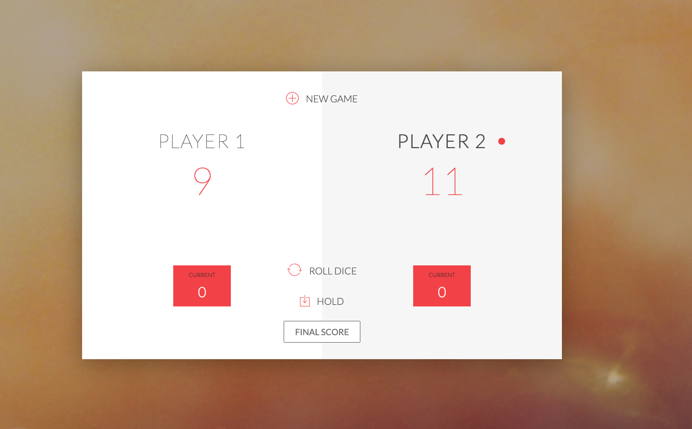

# 자바스크립트 공부 방향성 단계 정리

- 일전에 자바스크립트 + Jquery 완전 정복 스터디라는 책을 보게 되었다.
- Jquery는 Django에서 단일 프레임워크로 해결할 수 없는 부분들을 보완하기 위해 학습했었다.

- 그러나 베트남 멋쟁이 사자처럼에서 곧 JS 풀스택으로 부트캠프를 열 수도 있는 상황이 발생했다.
- 이에 따라 자바스크립트 + 리액트 + Node.js를 사용해서 풀스택 부트캠프에 대한 학습이 필요한 상황이 발생했다.

- 이에 따라 바닐라 JS부터 학습을 시작해서 React, Node.js로 단계적인 학습을 진행하는 과정을 겪고자 학습을 시작했다.

- 학습 관련 강의 자료는 모두 Udemy를 보고 진행한다.

## 현재 학습 방향을 잡기 위한 강의 자료 학습 (7월까지 학습을 마무리해야함)

- 1. The Complete JavaScript Course 2020: Build Real Projects!

- 2. React - The Complete Guide (incl Hooks, React Router, Redux)

- 3. NodeJS - The Comlete Guide (incl. MVC, REST APIs, GraphQL)

## 베트남인들을 3개월 내지 6개월 정도 바싹 학습시켜서 취직을 시켜야한다.

- 이 사람들을 취직시켜려면 CS 관련해서 지식이 빠삭해야한다.

- 올해 말까지 인공지능 방향도 학습이 반드시 필요할 것이다.

- 살면서 남들에게 지식을 전수하면서 나까지 배울 수 있는 이런 기회는 두 번 다시 오지 않는다. 지금 베트남에 있는 이 순간의 기회를 최대한 활용하자.

## 학습 리뷰

1. **Budget App을 제작하는 과정(2020.06.10)**

- Budget APP을 ES5 문법으로 제작하는 과정이 JS 전 과정을 다룬다고 할 정도로 내용이 충실하다.

- 해당 내용을 3번 정도 복습해보고, ES6 문법을 활용해서 코드 양을 줄이고, 새롭게 추가된 내장 메소드를 사용해서 전반적인 코드를 Refactoring 해보는 작업을 겪어보는 것이 필요하다.

  

2. **ES6 문법에 대한 재조명 (2020.06.13)**

- 자바스크립트를 너무 몰랐다고 생각할 정도로 ES6 문법이 다채롭다.

- 기존에 알던 것은 const, let, arrow function 정도가 전부였는데, 내장 메소드가 꽤 추가된 것을 확인할 수 있다.

- 아직까지 내가 상당히 무지하다는 점을 새삼 다시 느끼게 된다.

- 강의에서 다루는 Budget App을 충분히 활용하고, 기능을 추가해서 내용물을 내 것으로 완전하게 소화하는 과정을 반드시 겪어야한다.

- ES6에서 추가된 ...문법의 경우, 파이썬에서 사용하는 \*kwarg와 역할이 동일한 것 같다. 전달받는 인자 값이 몇 개인지 모를 때 전부 받아오는 형태의 문법이라 이해하면 될 것 같다.

  

3. **스타크래프트도 프로선수들 영상 많이 본다고 잘하는 것은 아니다 (2020.06.13)**

- 스타크래프트 프로선수들 경기 유튜브를 많이 본다고 게임 잘하는 것이 아니듯, 프로그래밍도 강의 영상 많이 본다고 잘한는 것이 절대 아니다.
- 결국 게임이나 코딩 모두 따라 쳐보면서 실제로 어떻게 작동하는지를 이해하는 것이 중요한 과정이다

4. **ES6 Syntax Coding Challenge Review (2020.06.14)**

- 여기서 배우게 되는 ES6 문법과 Class 개념은 Budget App 과제 다음으로 중요한 내용이다.
- `Reduce`, `Filter`, `Map`, `forEach` 등의 개념을 구분해가면서 필요한 상황에 사용할 수 있는가?

5. **Promise / Async / Await (2020.06.15)**

- `Promise`의 작동 원리에 대한 이해
- Object that keeps track about whether a certain event has happened already or not.
- Determines what happened after the event has happened.
- Implements the concept of a future value that we are expecting.

6. **Food Recipe App (2020.06.15)**

- Modern JS를 활용한 App의 최종본
- Udemy The Complete Javascript Course 2020: Build Real Projects!의 최종장
- 결국 Budget App, Class Practice, Recipe App 이 3개가 이 수업의 핵심이다.
- package.json 설치 -> npm init
- React로 연결되는 Self Webpack setting, package.json 등을 굉장히 디테일하게 알려준다.

7. **JS Execution Process (HTML에서 script로 읽어들일 때)**

- JS가 HTML body 태그 하단에서 보통 fetch되어서 (다운로드 되어서) Execute하는 경우
- JS를 `<head>`에 추가해서 fetch하는 경우 (최악의 JS 로딩 방법)
- Async를 사용하는 방법 -> 여전히 Parsing HTML을 하면서 Blocking이 발생함
- 최선의 선택은 `<script defer src='./file.js'>` 이런 형태로 호출하는 것이다.
- JS에서 type of (null)을 입력하면 객체(object)가 반환되는데, 해당 부분은 버그라고 해도 할 말이 없다. (Learning JS by O'Reilly)
- null이 다른 코드에서 원시 값(Primitive)으로 취급하는 것과 반해 차이가 있는데, 이미 너무 많이 이 사실을 사용하는 코드가 생겨났고, 공식 문서에도 기록되어 변경하기가 어렵다는 것이 정설인 것 같다.

8. **Node를 사용해서 서버를 구성하고, e.js를 구성해서 JS 풀스택을 구성하는 방법**

- Routing을 사용하는 방법과 nodemon 등의 라이브러리를 사용해 프로젝트를 작업한다.
- 이 Udemy 강의의 마지막 내용인데, Node.js로 연결되는 접점을 제공한다.
- 이 강의에서 React.js 환경 설정을 잡는 것과 Node.js 설정을 잡는 것이 인상적이다.
- Babel이 없다는 상황을 가정해보면, 결국 React.js나 Node.js 모두 Vanilla JS로 코드를 작업할 수 있다는 뜻을 내포하고 있다.

9. 마치며...

- HTML, CSS, JS를 잘 이해하고 활용한다는 것은 무궁무진한 가능성을 내포한다.
- 위의 내용들은 정말 기초의 기초다. HTML, CSS, JS를 극한까지 잘 다루는 것은 아래의 이미지를 만들 수 있다는 것과 같다.

- Liscense by [3D Solar System with Code pen](https://codepen.io/juliangarnier/pen/idhuG?__cf_chl_jschl_tk__=cdec3c55e32622f5fd94e8f66e4e218ae4286ead-1592585152-0-AU7sLT2BOPCtkAfAUfmOyW7qLOVRHGzuhCoLLlrpJ-gdbyIpgFsdHmm9OIoD56ANdRjX-VVQJrZ1f4wHDAhI2gDTq0_NDt0oVynEMvzEbDm1TnZos6q_PEdeXwltKeUFmzOmKVvXH0kg03O86jqJ4Z6Uk24BAiHa24HBZWmkQBhRbaRS1dnvq-nEJkSK8_LJ6Jc0JhXP8yshnGuOO4Eph-tb67AQBvUV72oSzZ0WY0rqezBoPNxldUDK0yfWMvk3XCou94Sz7ftOpgwbLRlNyTbml4eOWwCyTD_lj8i_bMgK9m6ApOYXojCbOC24VyTLODo19iTndzH5VStl0Uc9R97N6EapsfSpURK4yxgYtlBk)
- JS를 극한까지 두드리자.

**p.s.)**

- Map 객체 (자바스크립트 내장 메소드인 .map이 아닌 객체가 있다)
- Map 객체는 키-값 쌍을 저장하며 각 쌍의 삽입 순서도 기억하는 콜렉션입니다. 아무 값(객체와 원시 값)이라도 키와 값으로 사용할 수 있습니다.
